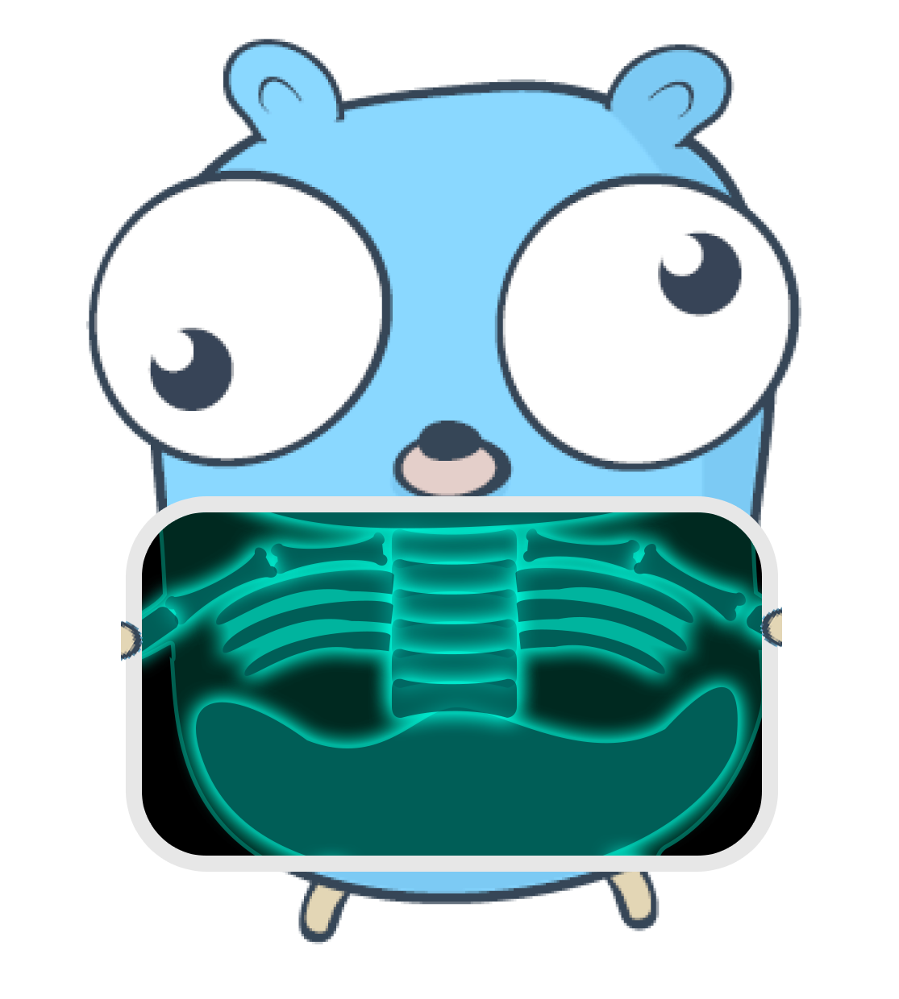

# GO-SKELETON

this is a simple golang app skeleton that proposes an architecture to provide: 
- http server
- grpc server
- elasticSearch repository
- dependency injection (container)
- metrics middleware (prometheus)
- contextualised services (i.e: request-scoped services)

---
# Table of Contents
1. [Requirements](#requirements)
2. [Install](#install)
3. [Run](#run)
    1. [gRPC/HTTP servers](#run-grpc--http-servers)
    2. [job](#run-job)
4. [Generate protobuf files](#generate-protobuf-files)
5. [TODOs](TODO.md)
---

## Requirements:

- Docker
- Docker-compose
- Golang with go-modules activated

## Install
```
go mod download
```

## Run
The skeleton app provides two commands/binaries: 
- a gRPC & HTTP server
- a job

### Run gRPC & http servers
```
go run ./cmd/server
```

### Run job
```
go run ./cmd/job
```

## Generate protobuf files
``` 
make proto
```
